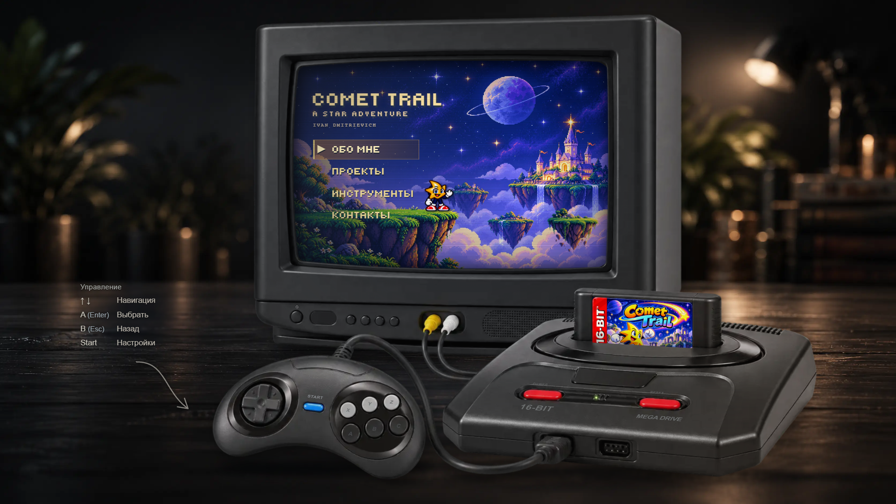
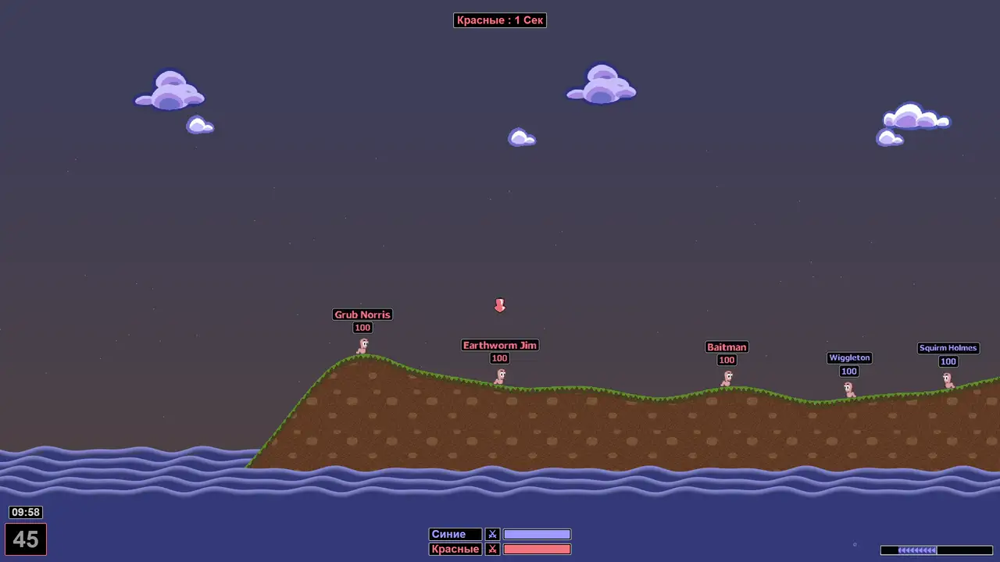

<h1>
  Ragna13377&nbsp;&nbsp;
</h1>

> The web was a good place to start. Seems like it's time to move on.

## Projects

<table width="100%" style="display: table; width: 100%; table-layout: fixed;">
  <tr>
    <td colspan="3" width="50%" align="center" valign="top" style="padding: 8px;">
      <h2 style="margin: 0 0 8px;">Interactive Portfolio</h2>
      
Explore my work through an interactive retro console. 
        <a href="https://ragna13377.github.io/portfolio/">Live Demo</a> · <a href="https://github.com/Ragna13377/portfolio">Source</a>
      

      
    </td>
    <td colspan="3" width="50%" align="center" valign="top" style="padding: 8px;">
      <h2 style="margin: 0 0 8px;">Worms.js</h2>
      
A simplified Worms Armageddon built with React Three Fiber / Three.js. 
        <a href="https://ragna13377.github.io/worms-js/">Live Demo</a> · <a href="https://github.com/Ragna13377/worms-js">Source</a>
      

      
    </td>
  </tr>
  <tr>
    <td colspan="2" width="33.33%" align="center" valign="top" style="padding: 8px;">
      <h2 style="margin: 0 0 8px;">Gothic 1 Lockpick</h2>
      
A practical lockpicking helper for Gothic 1 Remake. 
        <a href="https://gothic-1-lockpick.vercel.app/">Live Demo</a> · <a href="https://github.com/Ragna13377/gothic-1-lockpick">Source</a>
      

      
    </td>
    <td colspan="2" width="33.33%" align="center" valign="top" style="padding: 8px;">
      <h2 style="margin: 0 0 8px;">GameHub</h2>
      
Game price comparison across Steam and GOG. 
        <a href="https://github.com/Ragna13377/gameHub">Source</a>
      

      
    </td>
    <td colspan="2" width="33.33%" align="center" valign="top" style="padding: 8px;">
      <h2 style="margin: 0 0 8px;">SWAPI</h2>
      
Star Wars characters, filters and infinite loading. 
        <a href="https://ragna13377.github.io/swapi/">Live Demo</a> · <a href="https://github.com/Ragna13377/swapi">Source</a>
      

      
    </td>
  </tr>
</table>

### Notes

- [Docs](https://github.com/Ragna13377/Docs) — frontend notes on browser, web platform, HTML/CSS, JavaScript, TypeScript, React and Axios.

---

TypeScript · React · Next.js · Node.js · NestJS
