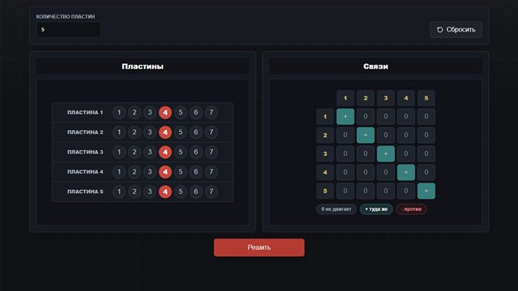
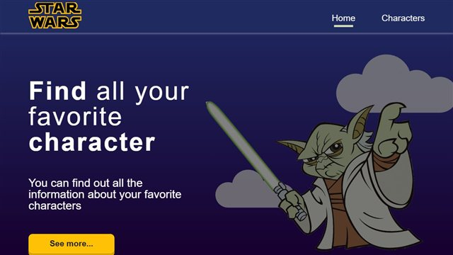
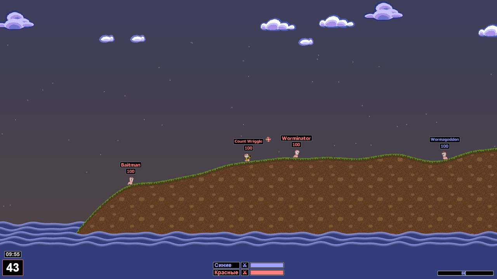
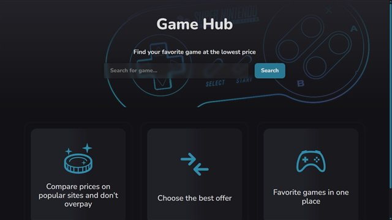

# Ragna13377

> The web was a good place to start. Seems like it's time to move on.

## Projects

| | Project | Source | Demo |
|---|---|---|---|
|  | **Comet Trail Portfolio** — interactive CRT-style portfolio | [Source](https://github.com/Ragna13377/portfolio) | [Demo](https://ragna13377.github.io/portfolio/) |
|  | **Gothic 1 Lockpick** — lockpicking helper for Gothic 1 Remake | [Source](https://github.com/Ragna13377/gothic-1-lockpick) | [Demo](https://gothic-1-lockpick.vercel.app/) |
|  | **SWAPI** — Star Wars characters, filters and infinite loading | [Source](https://github.com/Ragna13377/swapi) | [Demo](https://ragna13377.github.io/swapi/) |
|  | **Worms JS** — small React Three Fiber / Three.js experiment | [Source](https://github.com/Ragna13377/worms-js) | [Demo](https://ragna13377.github.io/worms-js/) |
|  | **GameHub** — Steam / GOG game search | [Source](https://github.com/Ragna13377/gameHub) | — |
| | **Docs** — frontend notes: browser, web platform, HTML/CSS, JavaScript, TypeScript, React and Axios | [Source](https://github.com/Ragna13377/Docs) | — |

---

TypeScript · React · Next.js · Node.js · NestJS

  

